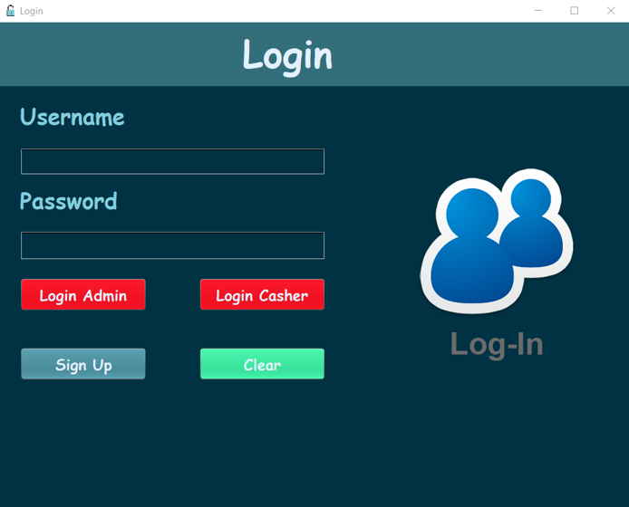
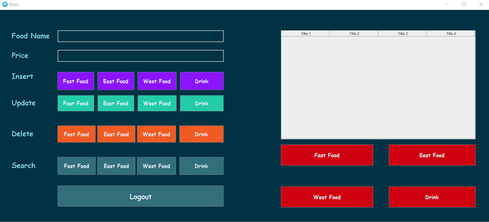
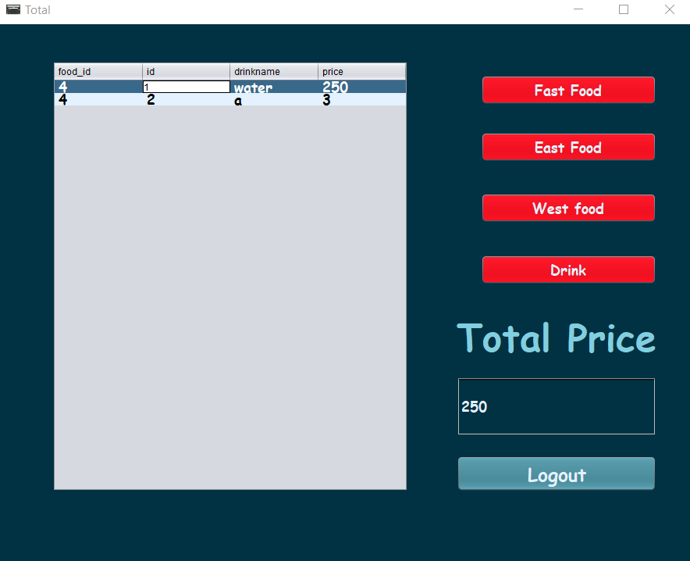

# KomodoDesktop

A cross-platform desktop application for restaurant food management, built with C# and Avalonia UI.

---

## The Story Behind This Project

This repository has a history worth explaining.

In 2019, when I was first learning programming, I built this application as a Windows Forms project using C# and SQL Server. At the time, I did not know how to properly upload code to GitHub. I only managed to upload **screenshots** of the running application — the actual source code never made it.

Those screenshots are still here in the `archive/` folder. They show the original Login, Admin, and Cashier windows exactly as they looked back then.

Seven years later, I came back to this project. I rebuilt it from scratch — properly this time — using modern tools that run natively on Linux. Same idea, same three windows, but with clean code, a real database layer, and no platform lock-in.

This is what growth looks like.

---

## What the App Does

A desktop food management system with two roles:

**Admin**
- Insert, update, delete, and search food items
- Four categories: Fast Food, East Food, West Food, Drink
- Manage user accounts

**Cashier**
- Browse menu by category
- View total price per category

---

## Tech Stack

| Layer | Technology |
|---|---|
| Language | C# (.NET 10) |
| UI Framework | Avalonia UI 12 (cross-platform) |
| Database | MariaDB / MySQL |
| DB Driver | MySqlConnector |
| Password Security | SHA-256 hashing |
| Platform | Linux, Windows, macOS |

---

## Project Structure

```
KomodoDesktop/
├── Models/
│   ├── User.cs
│   └── FoodItem.cs
├── Services/
│   └── DatabaseService.cs    # All DB operations, prepared statements
├── Views/
│   ├── LoginWindow.axaml     # Login screen
│   ├── AdminWindow.axaml     # Admin food management
│   ├── CashierWindow.axaml   # Cashier view
│   └── SignUpWindow.axaml    # User creation (admin only)
├── sql/
│   └── schema.sql            # Database setup
└── archive/
    ├── Login.png             # Original 2019 screenshot
    ├── Main.png              # Original 2019 screenshot
    └── Casher.png            # Original 2019 screenshot
```

---

## Setup

### 1. Requirements

- .NET 10 SDK
- MariaDB or MySQL

### 2. Create the database

```bash
mysql -u root -p < sql/schema.sql
```

### 3. Create a database user

```sql
CREATE USER 'komodo'@'localhost' IDENTIFIED BY 'yourpassword';
GRANT ALL ON komodo_desktop.* TO 'komodo'@'localhost';
FLUSH PRIVILEGES;
```

### 4. Update the connection string

Edit `Services/DatabaseService.cs`:

```csharp
private const string ConnectionString =
    "Server=localhost;Database=komodo_desktop;User=komodo;Password=yourpassword;";
```

### 5. Create the first admin account

Insert directly into the database using a SHA-256 hashed password:

```bash
# Get the hash of your password
echo -n "yourpassword" | sha256sum | cut -d' ' -f1
```

```sql
INSERT INTO users (username, password, role)
VALUES ('yourusername', 'your_sha256_hash_here', 'admin');
```

### 6. Run the app

```bash
dotnet run
```

---

## Archive — The Original 2019 Screenshots

These are the only things that survived from the original project.

| Login | Admin Panel | Cashier |
|---|---|---|
|  |  |  |

---

## License

MIT
